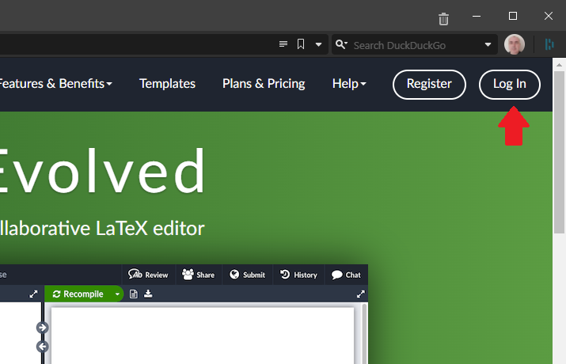
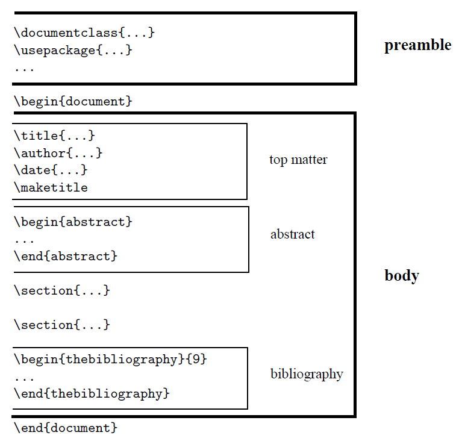
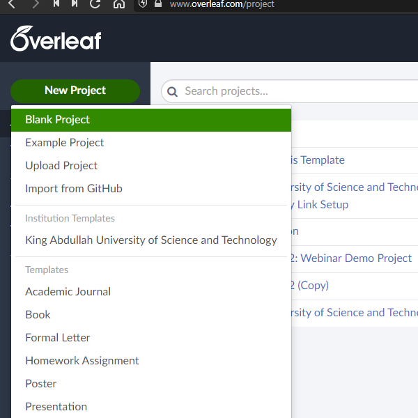
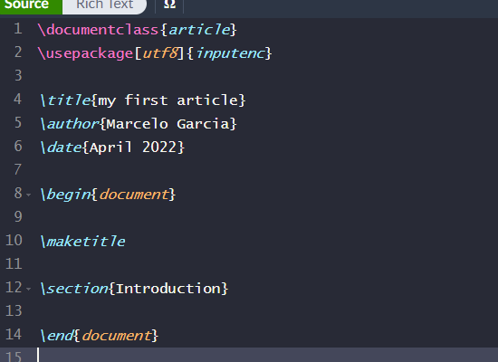
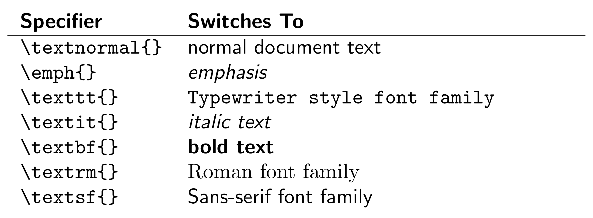
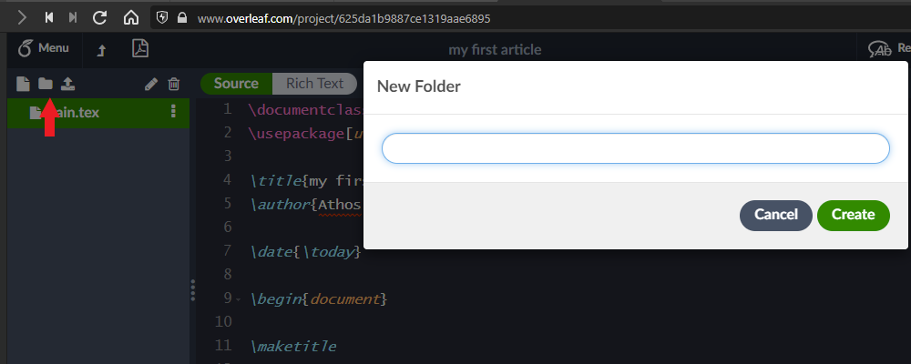
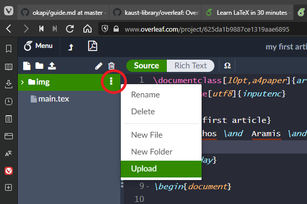
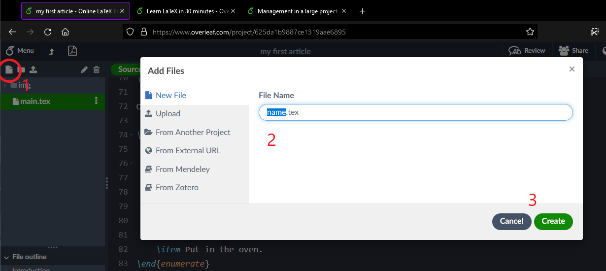
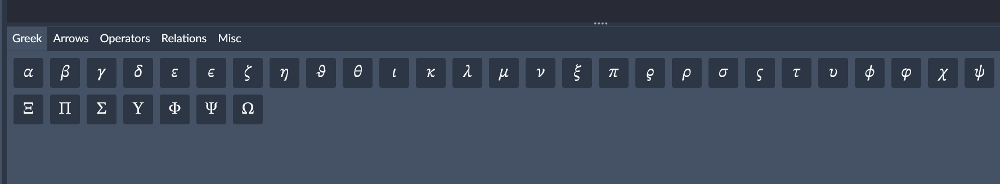

# Learning Latex with Overleaf

Or how to learn basic LaTeX with Overleaf in 30 minutes.

## Overleaf Login

[Overveaf login page](https://www.overleaf.com)



Next use the option to "Log in through your institution" to login using your KAUST credentials


## Text

### Latex Document Structure

Before learning more about Latex, it can be helpful to have an understanding of a Latex document structure. For example, all packages go in the _preamble_ that will discuss in more details later.



### Starting an Article

Once you login, you can create a new blank project



Notice that there are several options of templates, including the official KAUST templates for thesis and dissertation template. There are options for letters, books, CV/Resume, and others.

We will start with the _blank template_, and we will add content to our article.

After choosing the blank template, Overleaf will ask for a name for your project. You can give any meaninful name, like _my first article_. And your new article should looks like the following picture



Try to compile the text, and have a look at the PDF file.

### The Preamble

Everything that comes before the `\begin{document}` is the _preamble_. The preamble starts by defining what kind of document we are doing, via the `documentclass` clause. There are several kinds of document: article, book, letter, etc. It's also possible to define the paper size of the document. The default is US letter, but it's possible to change to A4 paper size, [among others](https://www.overleaf.com/learn/latex/Page_size_and_margins). 

Try to change the paper size to A4

```LaTeX
\documentclass[a4paper]{article}
```

You can go one step further, and add font size, like 11pt or 12pt

```LaTeX
\documentclass[10pt,a4paper]{article}
```

Next comes the list of packages that the text will use. In this case we are defining only the _encoding_, and `utf8` is the recommended. Unless you have a very specific need, don't remove the line. 

```LaTeX
\usepackage[utf8]{inputenc}  % !! Don't touch this line !!
```

### Top Matter

Next comes the title, the author(s) and the date. There isn't much to write about the title, but the others deserver some attention. 

How to add a second (or third author)? One could simply list the authors like

```LaTeX
\author{Athos, Aramis, and Porthos}
```

It will work, but a better approach is to use the `\and` clause

```LaTeX
\author{Athos \and Aramis \and Porthos}
```

To add authors affiliation, first add the package to your preamble

```LaTex
\usepackage{authblk}
```

Then edit the authors with their affiliation

```LaTeX
\author[1]{Athos}
\author[2]{Aramis}
\author[1,2]{Porthos}
\affil[1]{Alexandre Dumas School of Literature}
\affil[2]{Musketeers Institute of Classical Studies}
```

Try for yourself by compiling the text.

If don't include the `\date`, the document will have the date of the compilation, or you can set the date. Finally, if you want to remove the date completely, set an empty date

```LaTeX
\date{}   % For no date
\date{1st January 2000} 
\date{\today} % To explicity set to the date of compilation.
```

### Sectioning

LaTeX offers [several levels of section](https://www.overleaf.com/learn/latex/Sections_and_chapters), although, two of them will be available for _books_ and _reports_ only, and they are `part` and `chapter`. 

```LaTex
% \part{Part of book or report}
% \chapter{Chapter in a book or report}
\section{My section}
\subsection{My subsection}
\subsubsection{My subsubsection}
\paragraph{My paragraph}
\subparagraph{My subparagraph}
```

```LaTeX
Note that you can label a section (like equations, tables, and figures), and reference it later

\subsection{A Very Important Section} \label{S:very_important}
This section has some very important results. In this section we find the answer to the ultimate question of life and more.

\subsection{A Section}
Using the results from Sec.~(\ref{S:very_important}) we now can say for sure that the number ``42'' is the answer for ultimate questions of life, universe, and everything.
```

### Fonts

To emphasize text in LaTeX use the formatting commands: `\textbf{...}`, `\textit{...}`, and `\underline{...}.` Add the following text to your article

```LaTeX

\section{Text Formatting}

This text is in \textbf{bold}, and this is in \textit{italic}, and this one has \underline{underline.}
```

A general example of the fonts available in LaTex is

```LaTeX
\begin{tabular}{l p{0.6\linewidth} }
    \textbf{Specifier} &  \textbf{Switches To}\\ \hline
    \verb|\textnormal{}|  & normal document text\\
    \verb|\emph{}| & \emph{emphasis}\\
    \verb|\texttt{}| & \texttt{Typewriter style font family}\\
    \verb|\textit{}| & \textit{italic text}\\
    \verb|\textbf{}| & \textbf{bold text}\\
    \verb|\textrm{}| & \textrm{Roman font family}\\
    \verb|\textsf{}| & \textsf{Sans-serif font family}\\         
\end{tabular}
```

This table will produce a output similar to this



Try to put emphasis on text that is already emphasized.

```LaTeX
\emph{This text is emphasized, and \emph{we put emphasis inside} a block that is already emphasized!}
```

### Lists

LaTeX has 3 kinds of lists: bullet, numbered and description. A list is defined as parameter for the environment `\begin` and `\end`. Let's start by creating a section for our lists

```LaTeX
%
% Add a section for lists in your document.
\section{Lists}

\LaTeX{} has the basic types of lists: bullet and enumerate. They are also known as ``unordered'' or ``ordered''. We will add these two types of list, then we mix them. We finish adding another type of list: description list.
```

Now add all three kinds of list to your document.

```LaTeX
A unordered list:

\begin{itemize}
    \item This is the first item on a bullet list.
    \item This the second item.
\end{itemize}

And an ordered list:

\begin{enumerate}
    \item First item in an enumerate list.
    \item And the second item.
\end{enumerate}

Of course you can combine the two types:

\begin{enumerate}
    \item The ingredients
    \begin{itemize}
        \item Eggs
        \item Milk
        \item Flour
    \end{itemize}
    \item Mix all ingredients in a bowl
    \item Put in the oven.
\end{enumerate}
```

To finish, the description list

```LaTeX
Now we present the ``description'' list:

\begin{description}
   \item[The Red Sea] is a small body of water.
   \item[The Red Sea] also has extensive shallow shelves, noted for their marine life and corals. The sea is the habitat of over 1,000 invertebrate species and 200 types of soft and hard coral. It is the world's northernmost tropical sea, and has been designated a Global 200 ecoregion. 
\end{description}
```

[Lists have a lots of options](https://www.overleaf.com/learn/latex/Lists), like changing the bullet or numbering style. 

### Typing Code

To type a piece of code, like Python, on your text, you can use the [`fancyvrb` package](https://ctan.um.ac.ir/macros/latex/contrib/fancyvrb/doc/fancyvrb-doc.pdf)(pdf). 

First add the package as usual

```LaTeX
\usepackage{fancyvrb}    % Add the package
```

Then add the piece of code to your LaTeX document:

```LaTeX
(...)
% The parameters are optional for the font size and family, and add line numbers
% on the left side, and frame above and below the code.
\begin{Verbatim}[fontsize=\small, fontfamily=courier, numbers=left, frame=lines]
from flask import Flask
app = Flask(__name__)
@app.route('/')
def home():
    return 'Flask with docker!'
\end{Verbatim}
```

### Big Projects

When working on big documents, that is, a [large projects](https://www.overleaf.com/learn/latex/Management_in_a_large_project), you might want to split the input file into several parts. LaTeX offers two ways to include files: `input` and `include`. The [difference is subtle](https://tex.stackexchange.com/questions/246/when-should-i-use-input-vs-include). 

The `input` command simply will insert the external file just like if you have typed, and you can have nested `input` files, that is, an `input` inside another `input`ed file. The syntax is:

```LaTeX
input{filename}
```

The syntax for the `include` command is very similar

```LaTeX
include{filename}
```

As discussed in the difference between the commands, the content of `include` will start in a new page, if this behaviour is not desireable, then one must use the `input` command instead. But on the other hand, `include` can be used with `includeonly` with can be handy in really big projects, because, as the name suggests, will include only selected files into the main document.

To use `includeonly`, add it to the _preamble_ of the document

```LaTeX
includeonly{filename1, filename2, ...}
```

and only those files will be included in the main document.


## Images

### Adding Image to Overleaf

To add [images to a LaTeX document](https://www.overleaf.com/learn/how-to/Including_images_on_Overleaf) in Overleaf, it's necessary to upload them first. It's recommended to create a folder for the images so they are separated from the regular documents.



Give a name to your folder, something like `img,` or `images,` or `pictures`. 

Next upload the picture



Add the package `graphics` to the preamble, and set the path to the images, although this not strictly necessary because Overleaf will suggest the full path to the picture.

```LaTeX
\usepackage{graphicx}
\graphicspath{ {img/} }
```
add the picture to the document

```LaTeX
\section{Images}

Now we are going to add pictures to the document

\includegraphics[width=0.6\textwidth]{bombetoka_aster_23aug00_lrg.jpg}
```

Here we also [set the width of the picture](https://www.overleaf.com/learn/latex/Questions/How_do_I_specify_the_size_of_an_image_in_LaTeX%3F) to be 60% of the text width. There are many ways of [setting the size of a picture](https://www.overleaf.com/learn/latex/Inserting_Images#Changing_the_image_size_and_rotating_the_picture), like with parameter `scale` or explicitly with `width` and `height`. For example,

```LaTeX
\includegraphics[scale=0.1]{bombetoka_aster_23aug00_lrg.jpg}  % 10% original size.
\includegraphics[width=5cm, height=4cm]{bombetoka_aster_23aug00_lrg.jpg} % setting size of picture
```

### Label, and Caption

Now that we have picture in our document, we can add a caption, and a label. The label will allow us to reference the picture in the text. 

We will set a environment for the picture so we can add the extra configuration

```LaTeX
\begin{figure}[ht]
    \centering
    \includegraphics[width=0.6\textwidth]{bombetoka_aster_23aug00_lrg}
    \caption{An Otherworldly-Looking Bombetoka Bay, Madagascar}
    \label{fig:Bombetoka_Bay}
\end{figure}
```

You cloned the Github repository, you can add the following to code to include 2 pictures

```LaTeX
%
% Picture environment start
%
\begin{figure}[ht]
    \centering
    \includegraphics[width=0.6\textwidth]{bombetoka_aster_23aug00_lrg}
    \caption{An Otherworldly-Looking Bombetoka Bay, Madagascar}
    \label{fig:Bombetoka_Bay}
\end{figure}
% Picture environment end

In Fig.~(\ref{fig:Bombetoka_Bay}) we see a picture from a bay in Madagascar, where the salty waters of the Mozambique Channel penetrate inland to join with the freshwater outflow of the Betsiboka River, forming Bombetoka Bay. 

Next we have another beautiful picture from somewhere in planet Earth. In the next picture will have a different number from the previous picture.

%
% Picture environment start
%
\begin{figure}[ht]
    \centering
    \includegraphics[width=0.6\textwidth]{Susquehanna_River.jpg}
    \caption{The Susquehanna River}
    \label{fig:Susquehanna_River}
\end{figure}
% Picture environment end

In Fig.~(\ref{fig:Susquehanna_River}) we see the Susquehanna River cutting through the folds of the Valley-and-Ridge province of the Appalachian Mountains in this photograph taken by the crew of the International Space Station.
```

You reference your pictures using the command `\ref{}`, with the label that you defined inside the `picture` environment.

Try to swap the pictures see if the reference to the pictures changes.

## Equations

Probably the strongest point of LaTeX is the typesetting of mathematics. 

Add a new file to your project, and give it a name, something like `equations.tex`



Before starting to work with equations, add these 2 packages

```LaTeX
\usepackage{amssymb,amsmath}
```

> *Note*
> You can add packages one line per package, or add several packages in one line. This is a personal choice. 

On the main document, `main.tex`, add the command to include the new file

```LaTeX
%
% Include file. Just text, no preamble part, but we keep the heading ("section") here to make easier to read the main document.
\section{Equations}

\input{equations.tex}
```

Now start adding text to `equations.tex` file

```LaTeX
Here we present what is probably the strongest points of \LaTeX{}: mathematical typesetting. 

\subsection{Simple Maths}

In this document we will add equations, and other mathematics stuff. We start with the \emph{in line} mode,  where the equation is directly on the text. 

The very famous Einstein's equation is $E = mc^2$, where $m$ is the mass of the object, and $c$ is the speed of light in the vacuum. You put something a little more interesting in the in line equation, like an integral: $\int \zeta^{2}(x) \, dx$, or a simple fraction: $\frac{1}{x + y}$. 
```

But like figures, if the equation is more complex, it's a good idea to put inside an _equation_ environment. Let's see some examples:

```LaTeX
Consider the following equation

\begin{equation}
    \int_{a}^{b} f(x)dx = F(a) - F(b)
    \label{E:CalcFundemental}
\end{equation}

The Eq.~(\ref{E:CalcFundemental}) is known as \emph{Fundamental Theorem of Calculus}.
```
Note that we can use the `\ref{}` command like we did for pictures to reference the equations by the label.

There are many options available when working with mathematics in LaTeX: [mathematical expressions](https://www.overleaf.com/learn/latex/Mathematical_expressions), [brackets and parantheses](https://www.overleaf.com/learn/latex/Brackets_and_Parentheses), [Greek letters and other math symbols](https://www.overleaf.com/learn/latex/List_of_Greek_letters_and_math_symbols), etc. 

Overleaf (premium) offers a symbol palette that can be helful in the beginning until one memorize the symbols, like Greek letters, that are frequently used



### Aligning Equations

In case presenting how to solve an equation, we would like to beautifuly displayed, like aligning at the equal sign. Or in case of long formulas, it can be necessary to split it in multiple lines. Make sure already have imported the package `amsmath` in your main document.

Start a new subsection on your document

```LaTeX
\subsection{Aligning Equations}

Aligning formulas and multi line equations.
```

Add the following equation to your `equations.tex` document, and compile it.

```LaTeX
\begin{equation}
\begin{split}
A & = \frac{\pi r^2}{2} \\
 & = \frac{1}{2} \pi r^2
\end{split}
\label{eq1}
\end{equation}
```

You will see that the equation is aligned by the equal sign. If you prefer to omit the equation number, you can do it by adding an asterisk (*) after the equation (at the beginning and the end), like this

```LaTeX
\begin{equation*}
(...)
\end{equation*}
```

But keep in mind that this will not reset the counter, and following equations will count will have a "gap" in the numbering, which can be confusing. If you just want to present an piece of math, use the `\[...\]`

```LaTeX
\[
(...)
\]
```

Displaying a long equation, the line break mark are the two backslash (`\\`)

```LaTeX
Dislaying a long equation

\begin{multline}
    p(x) = 3x^6 + 14x^5y + 590x^4y^2 + 19x^3y^3\\ 
         - 12x^2y^4 - 12xy^5 + 2y^6 - a^3b^3
\end{multline}
```

## Tables

Table in LaTeX are provided by the _tabular_ environment. The general format of the is

```LaTeX
\begin{tabular}[pos]{ table spec }
```

The `table spec` are the number of columns, and the alignment of the text: `l` for left, `c` for center, and `r` for right. The `pos` is vertical position of the table relative to the baseline of the surrounding text. The options are: `t` for top, `b`, and `c` for center, but you hardly will use `pos` parameters.


```LaTeX
\section{Tables}

Creating a simple table in \LaTeX{} with 3 columns centered

\begin{center}
\begin{tabular}{ c c c }
 cell1 & cell2 & cell3 \\ 
 cell4 & cell5 & cell6 \\  
 cell7 & cell8 & cell9    
\end{tabular}
\end{center}
```

Next we will add borders to the table. To add boder at the columns, change the `table spec` to `\begin{tabular}{ c | c | c }`. Horizontal lines with `hline`. Add border to previous table

```LaTeX
Adding border to the table, and putting the table inside a proper `table` environment

\begin{table}[ht]
    \centering
    \begin{tabular}{c|c|c}
        \textbf{Col 1}& \textbf{Col 2} & \textbf{Col 3} \\ \hline
        cell1 & cell2 & cell3 \\ 
        cell4 & cell5 & cell6 \\  
        cell7 & cell8 & cell9     
    \end{tabular}
    \caption{Table with lines}
    \label{T:tab1}
\end{table}

On Tab.~\ref{T:tab1} with have added a line between the header and the data.
```

Next we consider a table with text. Try the following example

```LaTex
What about tables with text? Do they need any change or not? Let's see what happen when we try a naive approach

\begin{table}[ht]
    \centering
    \begin{tabular}{c|l}
         t &  Place the table at the \emph{top} of a text page\\
         ! & Used in addition to the other parameters, it overrides the restrictions of LaTeX over the floats (such as the maximum number of floats on a page) and helps to enforce the chosen parameter\\
    \end{tabular}
    \caption{Table with very wide column}
    \label{T:col_too_wide}
\end{table}
```

We can see that simply putting text on the table didn't work. So how fix this? The solution is to [use a different type of column](https://texblog.org/2019/06/03/control-the-width-of-table-columns-tabular-in-latex/) that are able to wrap the text. Here we use the `p{width}` option that aligh the text at the top of the cell.

The possible options for the placement are presented on the following table. Note we are setting the size of the column with text

```LaTeX
Next are placement options for the floating environment (like pictures and tables) in \LaTeX{}

\begin{table}[ht]
    \centering
    \begin{tabular}{c p{0.6\linewidth} }
         \textbf{Specifier} &  \textbf{Placement}\\ \hline
         t & Place the table at the \emph{top} of a text page\\
         b & Place the table at the \emph{bottom} of a text page\\
         h & Place the table at the position in the text where the table environment is that is, \emph{here}\\
         p & Place the table on a separate float page\\
         ! & Used in addition to the other parameters, it overrides the restrictions of LaTeX over the floats (such as the maximum number of floats on a page) and helps to enforce the chosen parameter\\
         H & Comes with the ``float'' package, it absolutely forces the table to appear at the position in the text where the table environment is
    \end{tabular}
    \caption{Possible placement options for floating environment}
    \label{T:PosPlace}
\end{table}
```
## Bibliography

Overleaf has a very good [introduction to bibliography in LaTeX](https://www.overleaf.com/learn/latex/Bibliography_management_in_LaTeX), so here will limit ourselves to a simple introduction. 

1. Import the `biblatex` package
1. Specify the file with the bibliography entries
1. Add the command `\printbibliography`

On our LaTeX document we would have something like this

```LaTeX
% In the preamble
\usepackage{biblatex}
\addbibresource{hello.bib}
(...)
% Your document
(...)
% At the very end
\printbibliography
```

The entries for your bibliography can be of [several kinds](https://www.overleaf.com/learn/latex/Bibliography_management_in_LaTeX#Reference_guide), like articles, books, thesis, online, and much more. We suggest to put as much as information as possible from the list of available fields, but keep in mind that the final bibliography will depend on the [_bibliography style_](https://www.overleaf.com/learn/latex/Biblatex_bibliography_styles). 

A reference to a book will look like

```LaTeX
@book{dirac,
    title = {The Principles of Quantum Mechanics},
    author = {Paul Adrien Maurice Dirac},
    isbn = {9780198520115},
    series = {International series of monographs on physics},
    year = {1981},
    publisher = {Clarendon Press},
    keywords = {physics}
}
```

Then, on your text, to make a reference to the Dirac's book: 

```LaTeX
The book \cite{dirac} is one of the fundamental text of quantum mechanics. 
```

To finish this section, a note about the bibliography style. One can customize the bibliography together with the package import

```LaTeX
\usepackage[
    style=alphabetic,
    sorting=ynt,
]{biblatex}
```

With the _alphabetic_ style, the bibliography will appear as `[Ein05]`, but if we change the style to _numeric_, the bibliography will appear as `[1]`. There are many other [customized styles](https://www.overleaf.com/learn/latex/Biblatex_citation_styles), like Nature, Science, IEEE, etc.

## Closing

The closing of this training is with two items: table of contents and abstract.

To create a [table of contents](https://www.overleaf.com/learn/latex/Table_of_contents) is very simple, just add the command at the place you want to create your table of contents. In general it will after the command `maketitle`

```LaTeX
%
% Add where the table of contents should be placed.
%
\tableofcontents
```

[You can also add list of figures and tables](https://www.overleaf.com/learn/latex/Lists_of_tables_and_figures).

Finally the abstract, as a good practice is the last thing we write. The abstract has it's own environment. Adding an abstract to our article. 

```LaTeX

\begin{abstract}
    In this brief \LaTeX{} training we covered a lot. We presented the basic elements of an article, lists, tables, equations, etc. On the Github page, we added references to Overleaf documentation so you can explore more in depth material. Finally, \LaTeX{} is a very well established, so you will have no problem finding how to do all sorts of things. As Alan Kay said ``Simple things should be simple, complex things should be possible.'' That is definitely true for Overleaf and \LaTeX{}.
\end{abstract}
```
