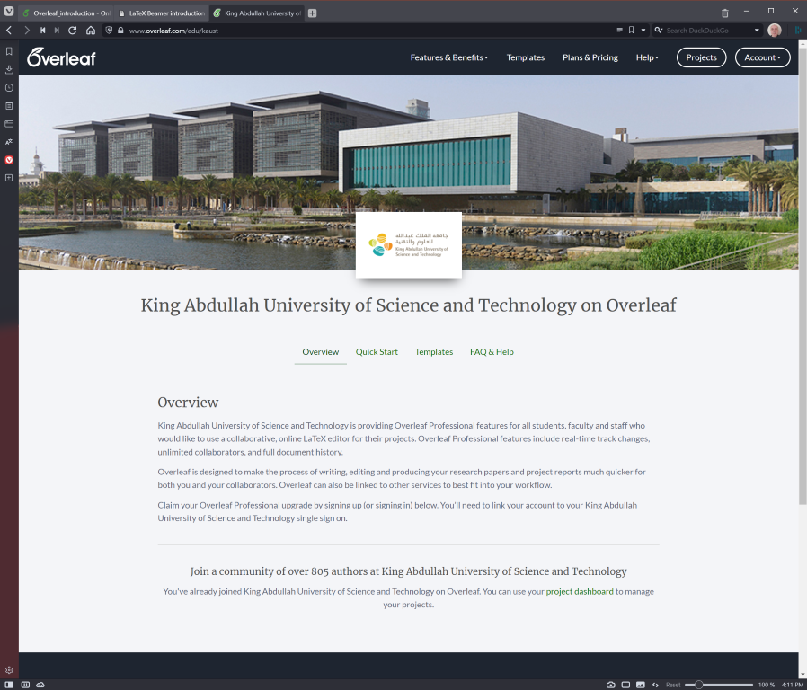

# Overleaf and Latex

This is a supporting material for the slides. Here you will find the examples for training.

The goal of this training is Overleaf, the LaTeX part will be very basic.

## Article

To create your first article, go to the [KAUST portal](https://www.overleaf.com/edu/kaust) in Overleaf

You can go to the _Quick Start_ or _Templates_ pages. On the _Quick Start_ there is a simple article with the basic LaTeX.
